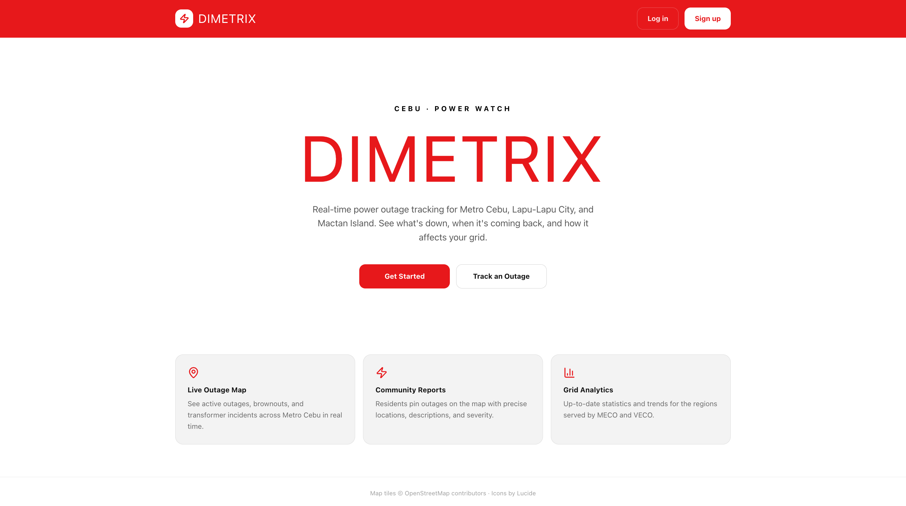
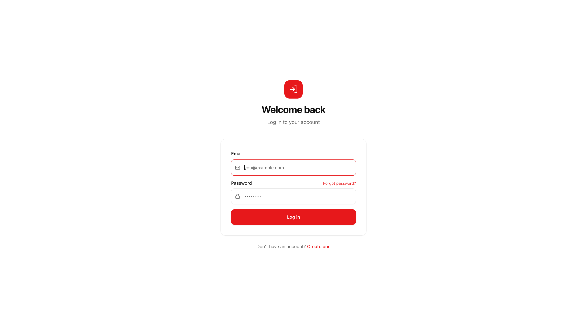
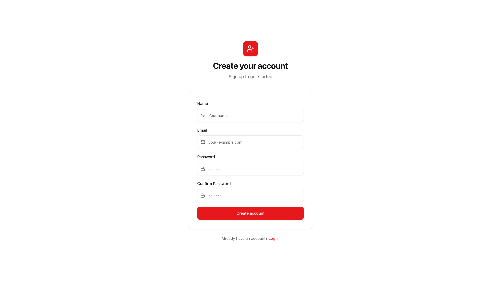
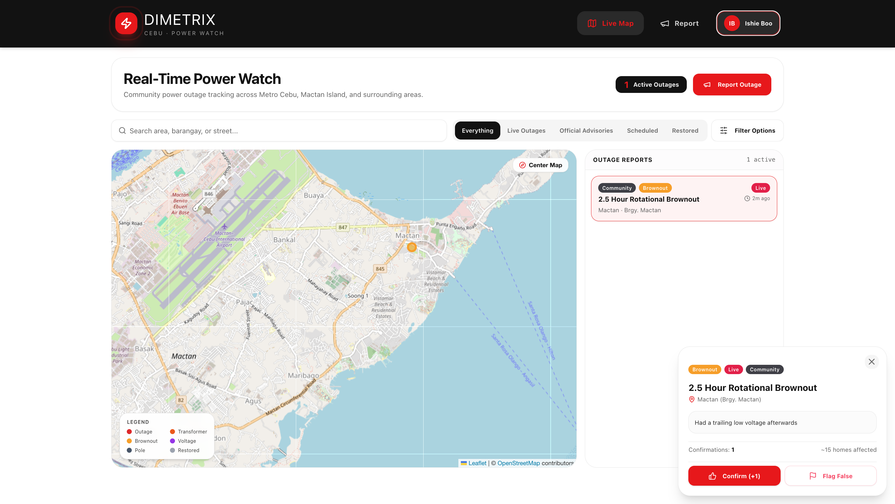
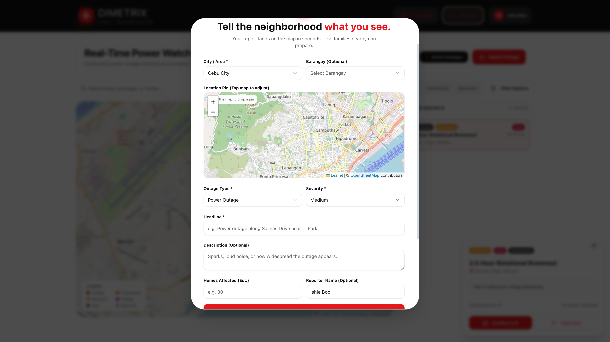
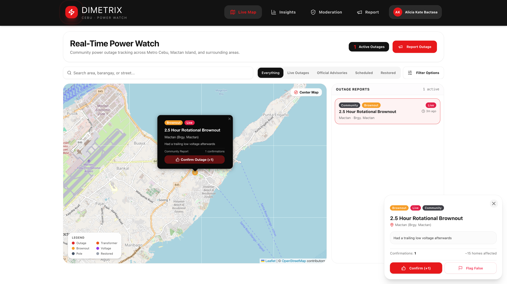
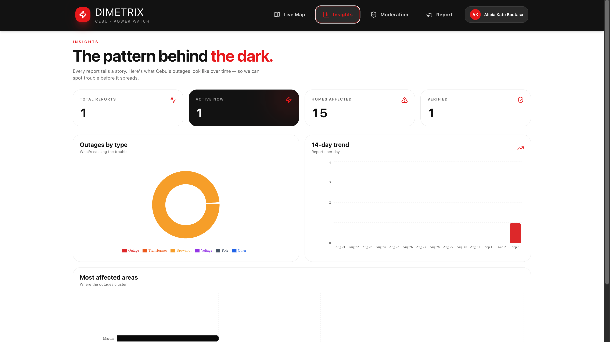
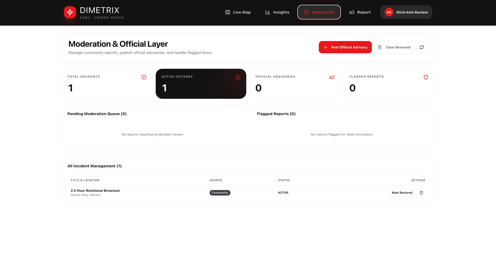

# Dimetrix — Metro Cebu Power Outage Tracker

**Dimetrix** is a real-time power outage tracking platform built specifically for **Metro Cebu, Lapu-Lapu City, and Mactan Island**. It gives residents and local teams a live, interactive view of active outages, scheduled brownouts, and transformer incidents — all on one easy-to-read map.

## Features

- Live interactive map of power outages across Cebu
- Report outages and pin precise locations on the map
- Filter by city, barangay, and utility provider (MECO / VECO)
- Real-time outage statistics and analytics dashboard
- Secure admin moderation panel

## Tech Stack

## Website

**Checkout** and **explore** the website here:
> ***dimetrix.vercel.app***

## Screenshots

<table>
  <tr>
    <td width="50%" align="center"><strong>Landing Page</strong>  </td>
    <td width="50%" align="center"><strong>Sign In</strong>  </td>
  </tr>
  <tr>
    <td width="50%" align="center"><strong>Sign Up</strong>  </td>
    <td width="50%" align="center"><strong>User Dashboard</strong>  </td>
  </tr>
  <tr>
    <td width="50%" align="center"><strong>Submit an Outage Report</strong>  </td>
    <td width="50%" align="center"><strong>Admin Dashboard</strong>  </td>
  </tr>
  <tr>
    <td width="50%" align="center"><strong>Analytics</strong>  </td>
    <td width="50%" align="center"><strong>Management</strong>  </td>
  </tr>
</table>

## Credits

- Map data & tiles: [OpenStreetMap](https://www.openstreetmap.org/)
- Icons: [Lucide Icons](https://lucide.dev/)
